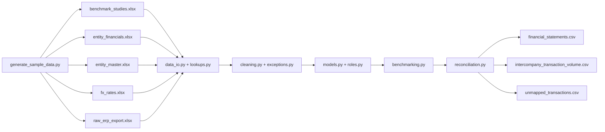

# Pharma Transfer Pricing Data Pipeline

A Python data pipeline for a pharmaceutical group's Transfer Pricing (TP)
analysis: it cleans an SAP-style ERP export, derives each entity's
functional role from its own invoicing pattern, benchmarks entities
against region-specific arm's-length studies, and produces a clean
dataset ready for Power BI.

## Business context

A classic pharma "Principal structure" across 3 regions, 6 legal entities:

| CompanyCode | Legal Entity | Region | Role | Benchmarked on |
|---|---|---|---|---|
| US05 | PharmaCorp USA Distribution Inc. | Americas | Distributor | Operating Margin |
| DE01 | PharmaCorp Deutschland GmbH | EMEA | Distributor | Operating Margin |
| FR03 | PharmaCorp France SAS | EMEA | Distributor | Operating Margin |
| SG01 | PharmaCorp Singapore Pte Ltd | APAC | Distributor | Operating Margin |
| CH04 | PharmaCorp Manufacturing AG | EMEA | Contract Manufacturer | Full Cost Mark-up |

Distributors are tested via **Operating Margin** (they carry market risk).
The Contract Manufacturer is tested via **Full Cost Mark-up** (a routine,
cost-based function doesn't control its own sales price). Both are tested
against **region-specific** benchmark studies.

## Project structure

```text
transfer-pricing-pipeline/
├── data/
│   ├── generate_sample_data.py   # creates all 5 Excel inputs
│   ├── raw_erp_export.xlsx       # SAP-style journal
│   ├── entity_financials.xlsx    # simple P&L per entity, in local currency
│   ├── mapping_gl_accounts.xlsx  # GLAccount -> TransactionGroup
│   ├── benchmark_studies.xlsx    # region-aware benchmarks with quartile stats
│   ├── entity_master.xlsx        # legal entity master data incl. Region
│   └── fx_rates.xlsx             # currency -> EUR conversion rate
├── src/tp_pipeline/
│   ├── data_io.py                # reads all 5 Excel files
│   ├── lookups.py                # builds fast in-memory lookups
│   ├── cleaning.py               # row cleaning + error handling
│   ├── exceptions.py             # custom exception classes
│   ├── models.py                 # Transaction, Entity, TPDataset (OOP)
│   ├── roles.py                  # derives functional role via Counter
│   ├── benchmarking.py           # margin/markup calculations + classification
│   ├── reconciliation.py         # IC/3P flagging + total reconciliation
│   └── pipeline.py               # orchestrates the full run
├── tests/                        # pytest unit tests
├── output/                       # generated by main.py
├── main.py                       # entry point
└── requirements.txt
```

## Data flow diagram



## How the pipeline works

1. Generate 5 Excel source files (generate_sample_data.py)
2. Read Files (data_io.py) and build in-memory lookups (lookups.py)
3. Clean each row, derive its transaction group from the GL account mapping (cleaning.py),
   route unmapped GL accounts to a data-quality log (exceptions.py)
4. Derive each entity's functional role from its own invoicing pattern (roles.py). Calculate Operating Margin (Distributors) or Full Cost      Mark-up (Contract Manufacturer) as properties on the Entity class (models.py).
5. Classify each entity against its region-specific benchmark using its calculated PLI (benchmarking.py)
6. Reconcile the journal total against the financials total (reconciliation.py)
7. Export:
   - `output/financial_statements.csv` - one row per entity with full P&L and benchmark result
   - `output/intercompany_transaction_volume.csv` - IC transaction volume by reporting entity/partner/role
   - `output/unmapped_transactions.csv` - data-quality log

## Setup & run

```bash
pip install -r requirements.txt
python3 data/generate_sample_data.py   # regenerate sample Excel files
python3 main.py                         # run the full pipeline
```

## Tests

```bash
pip install pytest
pytest tests/
```
## Next steps

Load pipeline outputs into a lightweight SQLite database and add example
SQL queries (joins, aggregations, window functions) for further analysis
